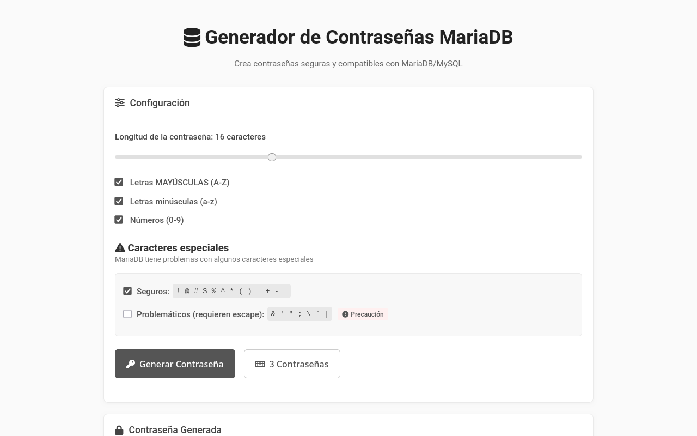

[ 🇬🇧 English Version ](README.en.md)

# MariaDB Secure Password Generator

Generador de contraseñas web del lado del cliente optimizado para **MariaDB/MySQL**. Este proyecto permite crear credenciales seguras y genera automáticamente los comandos SQL de creación de usuarios (`CREATE USER`), gestionando correctamente el escape de caracteres especiales.



---

## 🚀 Características

- **100% Client-side**: Todo el procesamiento se realiza en el navegador con JavaScript; nada se envía a un servidor.
- **Optimizado para MariaDB**: Algoritmos diseñados para manejar caracteres "seguros" y "arriesgados" en sintaxis SQL.
- **Generación de Comandos SQL**: Genera automáticamente la sentencia `CREATE USER` o `SET PASSWORD`.
- **Fisher-Yates Shuffle**: Implementación robusta para la aleatorización de caracteres.
- **UI Responsiva**: Interfaz moderna y adaptativa construida con CSS nativo.
- **Integración con Portapapeles**: Copiado rápido de contraseñas y comandos SQL con un clic.

---

## 🧩 Requisitos

- Cualquier navegador web moderno (Firefox, Chrome, Edge, Safari).
- No requiere servidor web, Node.js ni bases de datos para funcionar.
- **Opcional**: Servidor local (Apache/Nginx) si deseas alojarlo en red.

---

## 🧰 Instalación y Uso

Al ser una aplicación estática, no requiere compilación.

### 1. Clonar el repositorio

```bash
git clone [https://github.com/tu-usuario/password-generator.git](https://github.com/tu-usuario/password-generator.git)
cd password-generator
```

### 2. Ejecutar la aplicación

Simplemente abre el archivo `index.html` con tu navegador preferido:

```bash
# Desde terminal (ejemplo para KDE)
kioclient5 exec index.html
# O simplemente
firefox index.html
```

---

## 🧠 Cómo Funciona

La herramienta utiliza `crypto.getRandomValues()` (cuando está disponible) o `Math.random()` junto con el algoritmo de mezcla **Fisher-Yates** para garantizar que los caracteres no sigan patrones predecibles.

El flujo de generación en `script.js` sigue estos pasos:
1.  **Selección**: Construye un *charset* basado en las preferencias del usuario (Mayúsculas, Minúsculas, Números, Símbolos).
2.  **Garantía de entropía**: Fuerza la inclusión de al menos un carácter de cada tipo seleccionado antes de rellenar el resto.
3.  **Mezcla**: Aplica el algoritmo de barajado para eliminar el orden predecible de la inserción forzada.
4.  **Sanitización SQL**: Si se utilizan caracteres "problemáticos" (como `'` o `\`), la herramienta escapa automáticamente la cadena en el output SQL visualizado para evitar errores de sintaxis en MariaDB.

Ejemplo de salida SQL generada:
```sql
CREATE USER 'nuevo_usuario'@'localhost' IDENTIFIED BY 'tu_c0ntraseña_segura';
```

---

## ⚡ Sets de Caracteres

La aplicación clasifica los caracteres especiales en dos grupos para maximizar la compatibilidad con diferentes clientes SQL y shells:

| Tipo | Caracteres | Compatibilidad | Uso Recomendado |
|--------|------|----------------|-----------|
| **Safe** | `! @ # $ % ^ * ( ) _ + - =` | Alta | **Siempre** |
| **Risky** | `& ' " ; \ ` ` | Media/Baja | Requiere escape SQL |
| **Alphanumeric** | `A-Z`, `a-z`, `0-9` | Universal | Base de la contraseña |

*Nota: La herramienta gestiona automáticamente el escapado de los caracteres "Risky" en el bloque de código SQL.*

---

## 🧾 Licencia

Este proyecto incluye componentes bajo la siguiente licencia:

### 1. Font Awesome (Iconos)
Utilizado vía CDN, bajo licencia [CC BY 4.0 License](https://fontawesome.com/license).

### 2. Password Generator Code (este repositorio)
Todo el código original HTML, CSS y JavaScript — incluyendo la lógica de generación y la interfaz — es © 2025 **X Software** y se distribuye bajo la **Licencia MIT**.

Eres libre de usar, modificar y redistribuir este software bajo los términos de la Licencia MIT.  
Consulta la licencia completa aquí: [https://opensource.org/licenses/MIT](https://opensource.org/licenses/MIT)

---

## 🧑‍💻 Autor

Desarrollado por [**X Software**](https://xsoftware.es).  
Desarrollo de software Linux, soluciones web y automatización de sistemas.
